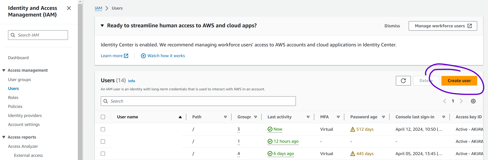

# Table management system

## To run it locally

1. Rename the `/packages/api/.env.sample` to `.env`
2. Fill the `.env` required variables (Marked with <>)
3. Run in the terminal: `npm install`
4. Run in the terminal: `npm run dev`

## To deploy to AWS

The CI/CD is already configure so you just need to make a commit to this repo in order to deploy a new version to staging/production.

### How to configure your the CI/CD using github actions and AWS

> Create user for deployment (AWS)

- Go to IAM service
- Click Users --> `Create User`

  

- Fill the user name and click on `Next`
- Click `Attach policies directly`, click on `AdministratorAccess` and click on `Next`
- Click on `Create user`
- View the created user.
- Click on the tab `Security credentials` and click on `Create access key`
- Click on the option `Command Line Interface (CLI)` and click on `Next`
- Click on the button `Create access key`
- Copy the keys `Access key` and `Secret access key`

> Configure your aws secrets in github

- Go to the repository settings
- Click `Secrets and variables` submenu `Actions`
- Click `New repository secret`
- Add a secret with a name `AWS_ACCESS_KEY_ID` and another with the name `AWS_SECRET_ACCESS_KEY` and paste the AWS secrets respectively.

> Environment variables

- Configure your secret environment variables in the environment variables section for the deployed lambda.
- Configure your public ui environment variables in the packages/ui/.env.production

> Configure and run serverless locally (OPTIONAL)

Execute the following command in your terminal:

- Setup AWS credentials to serverless

```shell
npx serverless config credentials --provider aws --key <your aws access key> --secret <your aws secret access key>
```

- Install and build

```shell
npm install
npm run build
```

- Deploy API

```shell
npx serverless deploy --stage develop -c serverless-api.yml
```

- Deploy UI

```shell
npx serverless deploy --stage develop -c serverless-ui.yml
```
